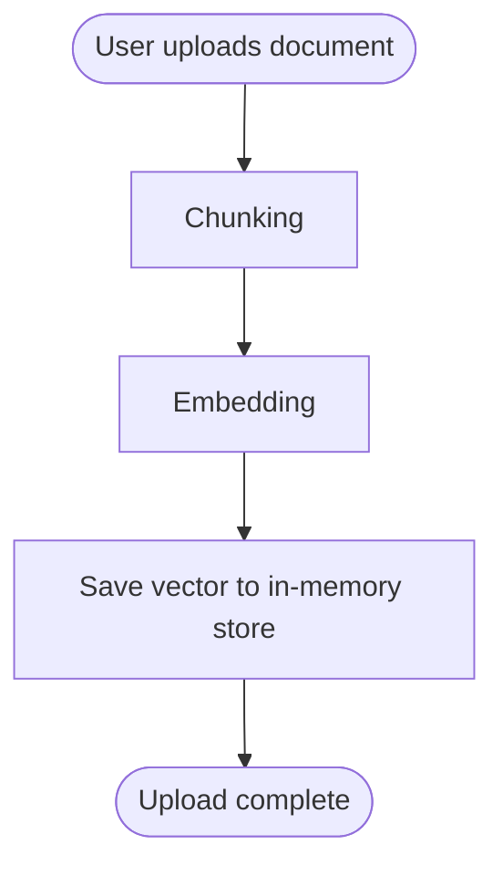
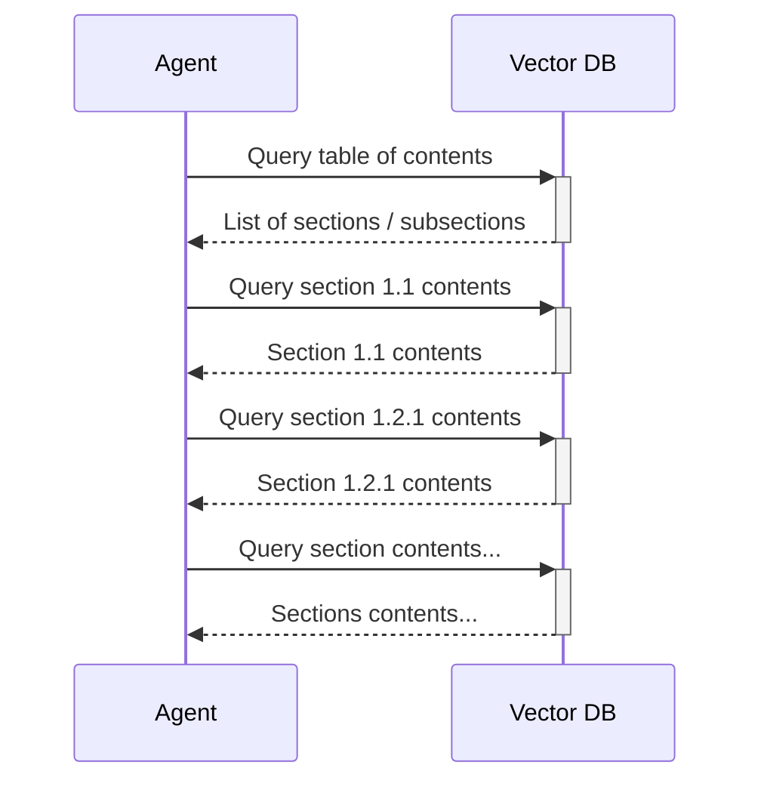

import TechLogo from "../../src/components/TechLogo.astro";

# Background

During my second semester at San José State University, the College of Graduate Studies department was put in touch with me regarding a software project.
Their editors were facing trouble with the volume of reports they had to verify for formatting errors.
Specifically, the delays introduced by going back and forth with students due to formatting mistakes caused delays in schedule with the publishers.

After a couple of brainstorming sessions, the proposal was to build a tool that could take student submissions and enforce formatting rules upon it.
The requirement was to take a student submission, which would be a PDF or DOCX document, and re-format it according to the rules.

# Challenges

This posed a difficult challenge, since PDF is an immutable format, it was not possible to modify the document without the source.

The first solution I considered was **Direct OCR on the PDF**, but this was extremely inconsistent.
The extracted text did not contain any context or structure, and cleaning up the ghost new-lines and other artifacts was a pain.
Then I considered building a **Retrieval-Augmented Generation (RAG)** pipeline from the extracted text.
This was an improvement over the direct OCR, but as I'd come to learn, it was still not perfect.
I decided to develop a prototype to learn more about RAG capabilities and limitations.

# Tech stack

- **Web experience**: <TechLogo name="nextjs" followColorScheme /> Next.js, <TechLogo name="react" followColorScheme /> React, <TechLogo name="typescript" /> TypeScript, Shadcn
- **Persistence**: <TechLogo name="gcp" followColorScheme /> Firebase Realtime Database
- **File hosting**: UploadThing
- **AI**: <TechLogo pack="simple-icons" name="langchain" /> LangChain; chat via OpenRouter; embeddings via Google's embedding models
- **Document handling**: docx.js (patcher), <TechLogo pack="simple-icons" name="langchain" /> LangChain PDF/DOCX loaders (Mammoth.js)

# Orchestration

The approach I decided to explore was to break down the source document and reconstruct it in a well-formatted document.
First, to break down the document, I parsed the document and chunked each page.
Then, I generated embeddings into a vector store.



To find out the layout of the documents, I queried the store using RAG to extract the table of contents.
Then, I repeatedly queried the store to extract the contents of each section.
In parallel, I extracted all the images and frontmatter like authors and title.
I used RAG again to identify the section that each image belonged to.



After collecting all of this information, I load up the new template document and begin applying the contents to it.
For this, I used a JavaScript framework called `docx`, which supports creating and patching OOXML-based document formats like `.docx`.

```
%title%
by
%author%

Submitted to: %submittedTo%
%university%

%tableOfContents%

%contents%
```

First, the section titles are loaded and the document metadata is patched.
At this stage, `%contents%` is treated as a meta-placeholder.
The agent replaces this with another placeholder-filled text that accommodates the contents of each section. 

```diff
-%title%
+My Document Title
by
-%author%
+Vivek Raman

-Submitted to: %submittedTo%
-%university%
+Submitted to: Department of Computer Science
+ San José State University

-%tableOfContents%
+1. Introduction
+  1.1. Background
+  1.2. Motivation
+...

-%contents%
+1. Introduction
+1.1. Background
+%contents-1.1%
+1.2. Motivation
+%contents-1.2%
```

This gives us an intermediate document with placeholders for each section.
The agent now populates the contents of each section.
Images and captions are attached at the end of their respective sections.

```diff
My Document Title
by
Vivek Raman

Submitted to: Department of Computer Science
San José State University

1. Introduction
  1.1. Background
  1.2. Motivation
...

1. Introduction
1.1. Background
-%contents-1.1%
+This is the background of the introduction.
1.2. Motivation
-%contents-1.2%
+This is the motivation of the project.
+<image>
...
```

Finally, since we wanted to alert the editors in case the document required consent forms, permissions, or disclosures, another RAG query is implemented.
If the document requires any of these, the agent will alert the editors accordingly.
Finally, the generated document is ready to be downloaded.

| Step ID                           | Role                                                                    |
| --------------------------------- | ----------------------------------------------------------------------- |
| **01-createTempFile**             | Persist upload to a temp path and record file type.                     |
| **11-parseDocument**              | Load PDF/DOCX into LangChain documents (split if few/large chunks).     |
| **12-generateEmbeddings**         | Chunk/embed text and build the vector store used later (always runs).   |
| **21-extractSections**            | LLM: infer thesis section structure.                                    |
| **22-extractMetadata**            | LLM: extract metadata fields.                                           |
| **23-extractImages**              | Extract images from the source document (always runs).                  |
| **31-extractContent**             | LLM: pull section body content (uses progress callback).                |
| **32-locateImages**               | LLM: relate images to captions / placement.                             |
| **41-patchSectionList**           | Build DOCX patches for the section list.                                |
| **42-patchSectionPlaceholders**   | Patches for section placeholders in the template.                       |
| **43-patchSectionContents**       | Patches for section body content.                                       |
| **44-patchMetadata**              | Patches for metadata placeholders.                                      |
| **51-loadTemplate**               | Fetch base `.docx` from `TEMPLATE_DOCX_URL` into `context.result`.      |
| **52-applyPatches**               | Apply `docx.patchDocument` to produce final buffer.                     |
| **81-scanForConsentRequirements** | Retrieval + LLM: list likely consent/IRB-style requirements.            |
| **99-uploadResult**               | Upload finished `.docx` via UploadThing; set `resultURL` (always runs). |
| **x-cleanup**                     | Remove temp artifacts when enabled by `stepsToDo`.                      |

# Limitations

I became quickly aware of the limitations and pitfalls in this approach.

### RAG prefers summarization over repetition
Using RAG helped in extracting the right contents for a specific section, but it was far too volatile.
Sometimes, extracting the contents of one section produced the contents of the subsections within, which is technically correct, but we needed just the block of text beneath the section title.
RAG performed very well in the tasks surrounding the primary requirement - scanning for consent requirements and extracting frontmatter information.

### Non-textual content is nearly impossible to decipher

The solution for pictures is extremely rudimentary and works only it the best case scenario.
It is quite inconsistent, especially for pictures containing text parseable by OCR.
There are an impossible number of edge cases where this system can fail.
Even basic tables cannot be extracted with sufficient context, leading to the model making a blind guess as to the shape of the table.
Complex tables with merged and disjoint cells simply cannot be consistently generated as-is.

# Then what?

I took this back to the drawing board.
The issue boils down to inconsistent outputs due to the unpredictability of the input data, so what if we offloaded that responsiblity back to the students?
I could build an agent that co-authors the thesis with the student, using LaTeX in the back so that the formatting is consistent.
This avenue was accepted by the department, so I decided to build it. It's called Spartan Write, and you can read more about it [here](/blog/spartan-write).
